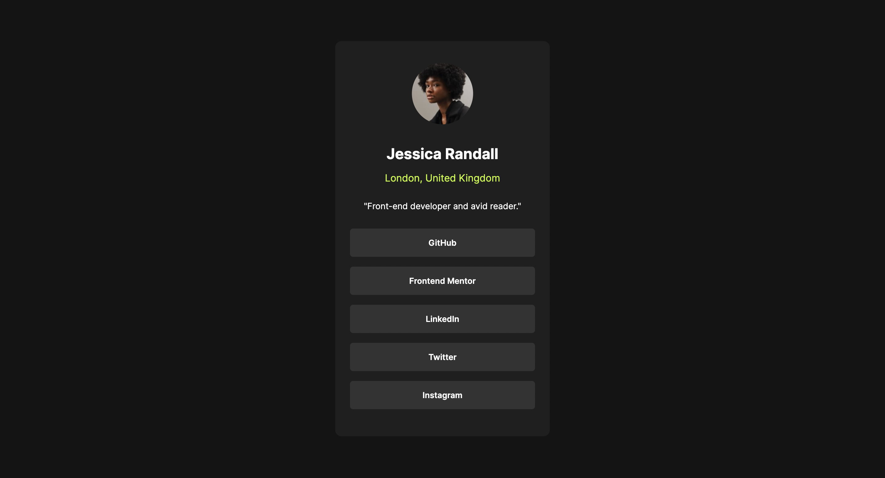
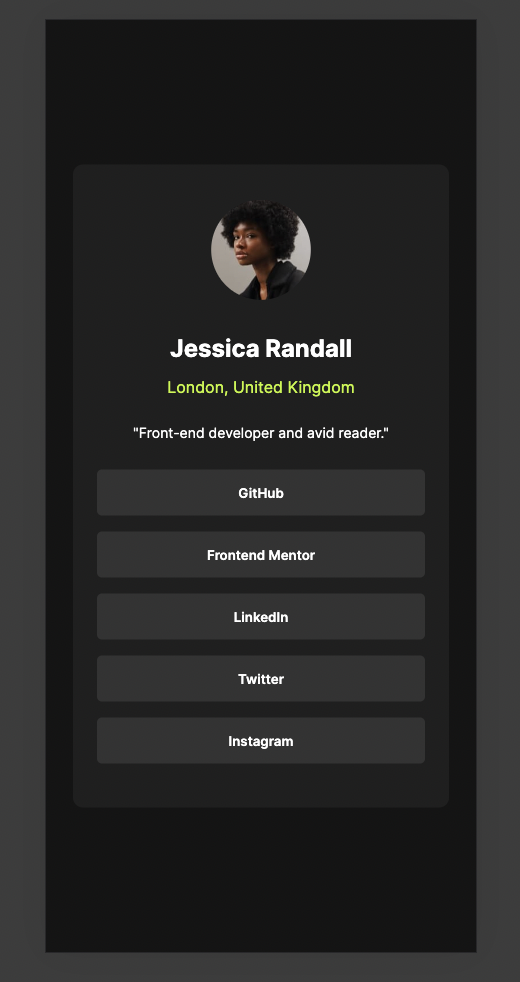
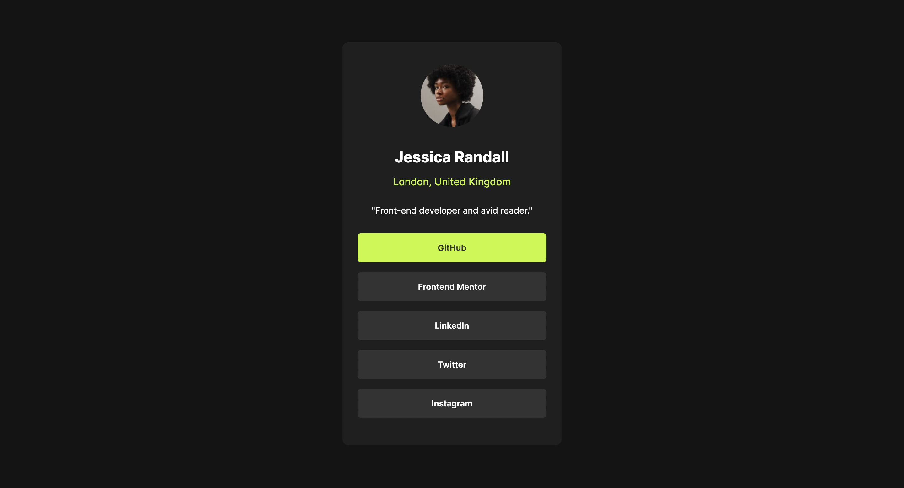

## Overview

### The challenge

Users should be able to:

- See hover and focus states for all interactive elements on the page

### Screenshot

#### Desktop View

#### Mobile View

#### Active View

### Links

- Solution URL: [Github](https://github.com/Kshitiz42069/frontend-mentor-Social)
- Live Site URL: [Live Link](https://kshitiz42069.github.io/frontend-mentor-Social/)

## My process

### Built with

- Semantic HTML5 markup
- CSS custom properties
- Flexbox

### What I learned

In this assignment I learned about the flex box, hover and practised the CSS styling.

## Author

- Website - [KshitizRai](https://github.com/Kshitiz42069)
- Frontend Mentor - [@Kshitiz42069](https://www.frontendmentor.io/profile/Kshitiz42069)

